# Setup Guide

Zero-knowledge proofs were implemented using Circom and SnarkJS. These include generating commitments using the secret, preventing double-spending using the nullifier, and storing commitments using the merkle trees.

## Setup Kit

### 1. Install Circom

```bash
# macOS
brew install circom
# other
git clone ...circom
```

### 2. Install Node.js

```bash
npm install
npm install circomlib
```

## SnarkJS implement Groth16 algorithm

### 1. Circuit compliation

Output:

* .r1cs
* .wasm
* .sym

```bash
circom zkp.circom --r1cs --wasm --sym
```

### 2. Trusted Setup

Begin a new Powers of Tau, then add randomness and prepare phase 2.

```bash
npx snarkjs powersoftau new bn128 12 pot12_0000.ptau -v
npx snarkjs powersoftau contribute pot12_0000.ptau pot12_0001.ptau --name="First contribution" -v
npx snarkjs powersoftau prepare phase2 pot12_0001.ptau pot12_final.ptau -v
```

### 3. Circuit setup

The combination of trusted setup and zkp.r1cs, then add randomness and export proof. Finally, generate the verifier's smart contract.

```bash
npx snarkjs groth16 setup zkp.r1cs pot12_final.ptau zkp_0000.zkey
npx snarkjs zkey contribute zkp_0000.zkey zkp_final.zkey --name="LKH Second Contribution" -v
npx snarkjs zkey export verificationkey zkp_final.zkey verification_key.json
npx snarkjs zkey export solidityverifier zkp_final.zkey verifier.sol
```

### 4. Generate proof and verify (Optional)

Inputs for calculating the circuit witness and generating proof data. Test proof validity and convert solidity's parameters format.

```bash
node zkp_js/generate_witness.js zkp_js/zkp.wasm input.json zkp_js/witness.wtns
npx snarkjs groth16 prove zkp_final.zkey zkp_js/witness.wtns proof.json public.json
npx snarkjs groth16 verify verification_key.json public.json proof.json
npx snarkjs generatecall
```

## Assumption paramters

```mermaid
graph TB

A(1957502675450735006995294171749393708380816510550016513572325377928709312799)
B(9438425462009327938113632977103012024864684806479150699875830550507114947861)
C(17318907088932163993936474574301200048277266577227880388615604770703611868473)
D(298403764318384535391080516430271416328384684759174479700768661756576886841)
E(1036650162605266689155569618988935551591700558940979379371025402092498979322)
F(574638457005259185998031631942469350070264178173448628390443390863409788906)
G(7448170595353527003863672443603688873547380028794982484418939571913494408099)
H(936107041880948892627387585343503772163411492212883657371352110448043907916)
I(19690291642042494239924132103815711450334047642868793290286571338144171123023)
J(17655239229322083820232532186697763406298275446239639267730473604556012682950)
K(21327735939661307440800272037408205556275099435297611196870074079183395690176)
L(17335417660864987354678670922850205919151640126204131061303827322575941656848)
M(2402940869403404244864558063085056800950375796069312073883409745963248554662)
N(12871884485430907466493029987701833346078251761744937672765509143535891807609)
O(3925193791967034329860766097738798776908475099659776634683788965881451539189)

A-->B
A-->C
B-->D
B-->E
C-->F
C-->G
D-->H
D-->I
E-->J
E-->K
F-->L
F-->M
G-->N
G-->O
```


