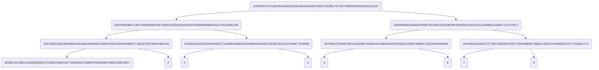

## Compile description

circom zkp.circom --r1cs --wasm --sym
npx snarkjs powersoftau new bn128 12 pot12_0000.ptau -v
npx snarkjs powersoftau contribute pot12_0000.ptau pot12_0001.ptau --name="First contribution" -v
npx snarkjs powersoftau prepare phase2 pot12_0001.ptau pot12_final.ptau -v
npx snarkjs groth16 setup zkp.r1cs pot12_final.ptau zkp_0000.zkey
npx snarkjs zkey contribute zkp_0000.zkey zkp_final.zkey --name="LKH Second Contribution" -v
npx snarkjs zkey export verificationkey zkp_final.zkey verification_key.json
npx snarkjs zkey export solidityverifier zkp_final.zkey verifier.sol
node zkp_js/generate_witness.js zkp_js/zkp.wasm input.json zkp_js/witness.wtns
npx snarkjs groth16 prove zkp_final.zkey zkp_js/witness.wtns proof.json public.json
npx snarkjs groth16 verify verification_key.json public.json proof.json
npx snarkjs generatecall

## Assumption paramters

